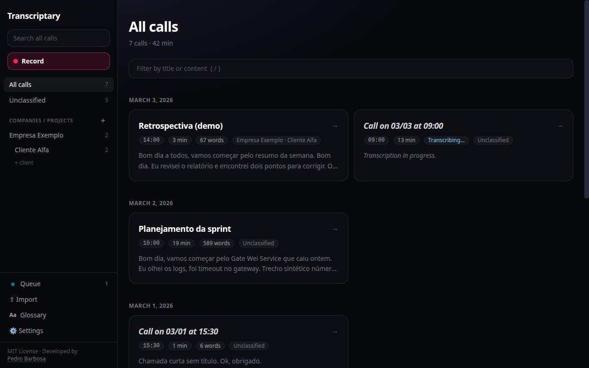
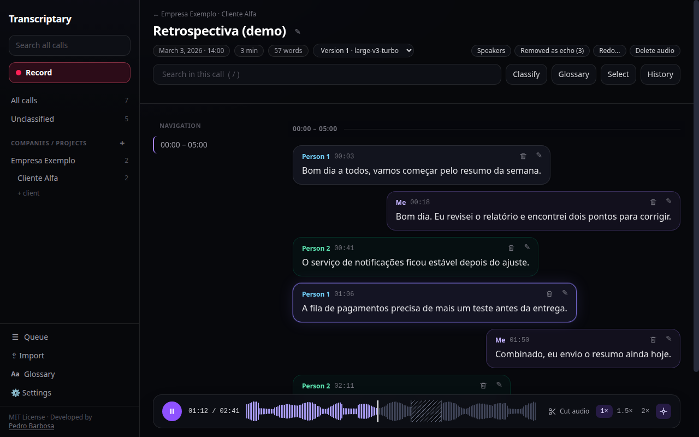
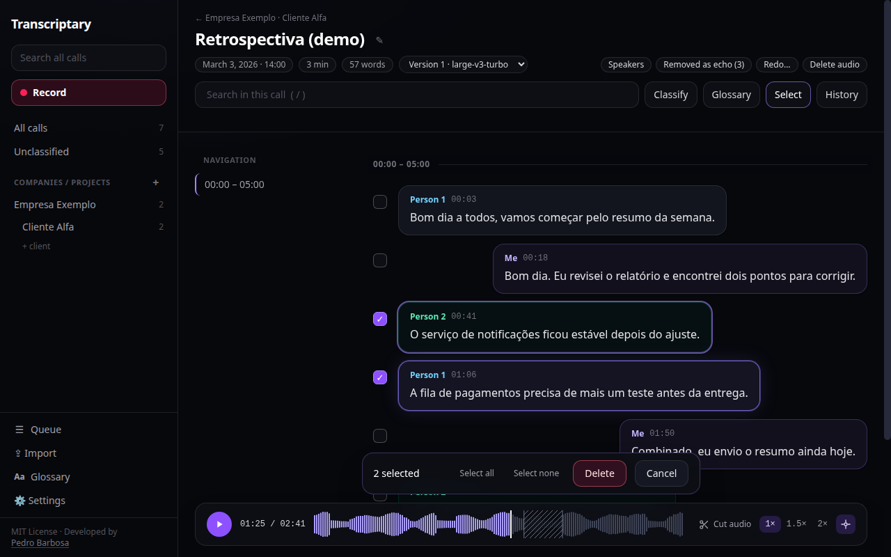
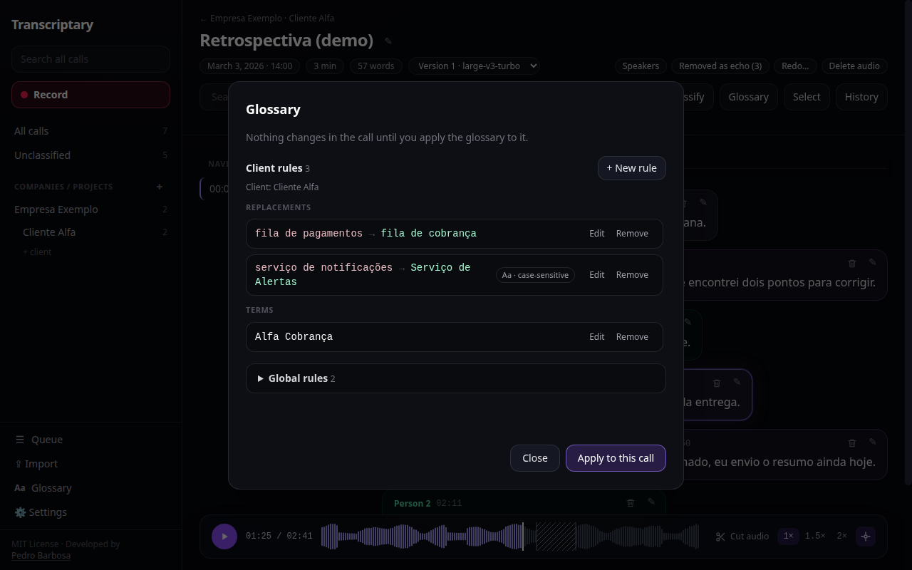
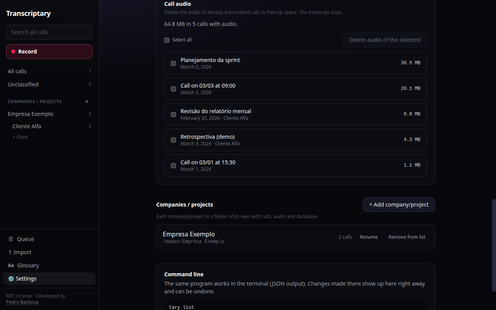

# Transcriptary

Records your calls, transcribes them and tells the speakers apart. Everything
happens on your machine: audio and text never leave your computer.

Linux only (PulseAudio or PipeWire). The interface comes in English, Brazilian
Portuguese and Latin-American Spanish (Settings > Language).



## Features

- **Record with one shortcut.** Press a key (or run `tary record toggle`) to
  start and stop. Your microphone and the other side of the call are recorded
  separately, which is how speakers are told apart.
- **Local transcription with speaker separation.** Transcripts are labeled by
  speaker. Nothing is sent to any service.
- **Libraries and clients.** File calls under companies/projects and clients,
  and search across all transcripts.
- **Audio player synced with the transcript.** Click a passage to jump to it,
  see the waveform, and speed playback up to 1.5x or 2x without changing the
  pitch.
- **Edit and clean up.** Edit passages, delete one or several at once, and undo
  from the history. Every change is logged and reversible.
- **Audio cuts.** Mark parts of the audio to skip, such as off-topic tangents.
  The player skips them and re-transcription ignores them. The original audio
  files are never modified.
- **Per-client glossary.** Terms and "wrong -> right" corrections, global or per
  client, applied to the transcripts.
- **Free disk space.** Delete a call's audio and keep its transcript.
- **Command line and agent skill.** The `tary` command and
  [`skills/tary/SKILL.md`](skills/tary/SKILL.md) let you, or an AI agent, record,
  search and edit transcripts.









The screenshots use synthetic data.

## Install

**AppImage (any distro)**

1. Download `Transcriptary_*.AppImage` from the [Releases](https://github.com/petebarbosa/Transcriptary/releases) page.
2. `chmod +x Transcriptary_*.AppImage`, then run it. After the first launch,
   Transcriptary appears in your app menu and search. Before deleting the
   AppImage, run
   `./Transcriptary_*.AppImage desktop remove` to take it out of the menu.
3. Optional, to get the `tary` command in your terminal:
   `ln -s /path/to/Transcriptary.AppImage ~/.local/bin/tary`

**Arch Linux**

```
cd packaging/arch && makepkg -si
```

## First run

Transcription needs an engine and speech models (about 1.7 GB). They are not
bundled: open **Queue** (or Settings) and click **Download and install**
(*Baixar e instalar* in pt-BR), or run `tary setup install`. This happens once.
Recording works without it, and finished recordings wait in the queue.

## Record

- Press **Ctrl+Alt+R** to start and stop (change it in Settings).
- Or from a terminal: `tary record start` and `tary record stop`
  (`tary record toggle` does both). `tary --help` lists everything.
- Wayland (e.g. Hyprland): global shortcuts are not available to apps. Open
  **Settings**, copy the snippet shown there into your compositor config, and
  it will call `tary record toggle`.

## Agent skill

To let a coding agent drive the app, symlink the skill: `ln -s "$PWD/skills/tary" ~/.claude/skills/tary` (or into `~/.agents/skills/`).

## Where your data lives

`~/.local/share/transcriptary` holds recordings, transcripts and the
transcription engine. Remove the folder to erase everything.

## Roadmap

Open work, tracked in [GitHub Issues](https://github.com/petebarbosa/Transcriptary/issues):

- [#12](https://github.com/petebarbosa/Transcriptary/issues/12) Verify the Arch PKGBUILD with a full source build.
- [#11](https://github.com/petebarbosa/Transcriptary/issues/11) Measure whether glossary hotwords help, once glossaries have enough terms.

## Build from source

You need Rust, Node.js/npm and the development packages for WebKitGTK 4.1,
GTK 3 and libpulse.

```
npm ci
npx tauri build --no-bundle   # binary at target/release/tary
npx tauri build               # AppImage in target/release/bundle/appimage/
```

## License

MIT, see [LICENSE](LICENSE).
